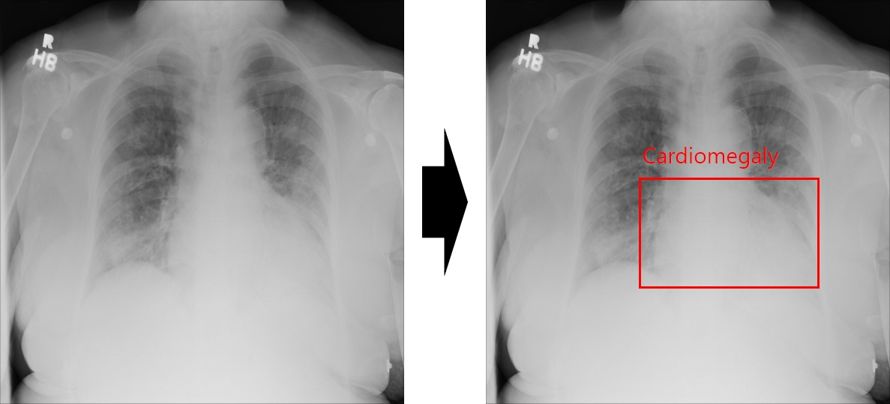
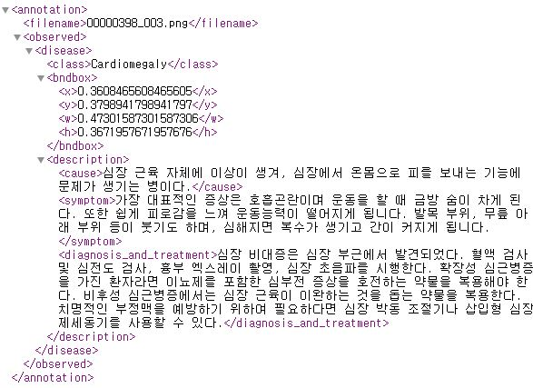

# X-rays-based-thoracic-disease-diagnosis-model

### **Data count and format**
> Class name 
Atelectasis, Cardiomegaly, Effusion, Infiltrate, Mass,Nodule, Pneumonia and Pneumothorax
> The number of subjects
880 dataset
> Directory 

Image

### **Examples**
image

Annotation
 

### **License**
>  

### **Reference**
>   

### **Download Link**
> https://drive.google.com/file/d/1SLQBrafbDi7W3G75bw_tKaV25C3HAk6N/view?usp=sharing
